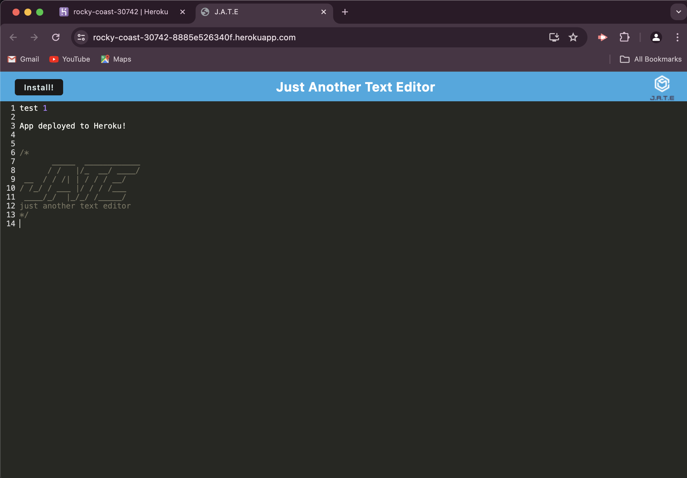
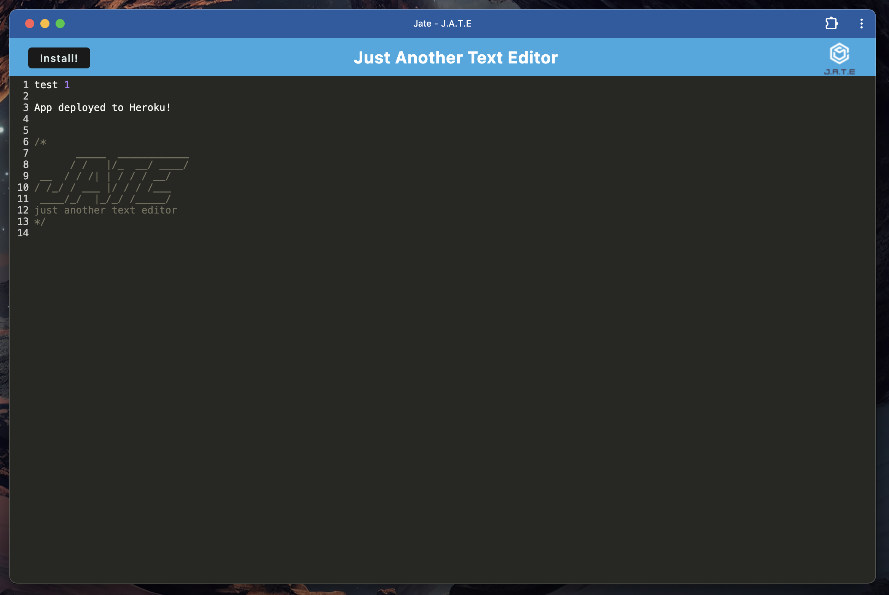

# rafa-progressive-web-application-text-editor

## Description

The goal of this project is to create a PWA text editor. The app allows the user to write text and save the data in the browsers indexed database. The user is also able to downloaded and use the appication offline.

## Installation

run "npm i" in the console to install the required packages.

## Usage

This is a text editor application intended to be used in the browser and/or locally. Users are able to save and retrieve data from the database.

## [Deployed Heroku Link](https://rocky-coast-30742-8885e526340f.herokuapp.com/)

## Screenshot of application




## Credits

N/A

## License

This project uses the MIT license.

## Badges


## Features
```md
- Write, save, and retreive text.
- Download and use application offline.
```